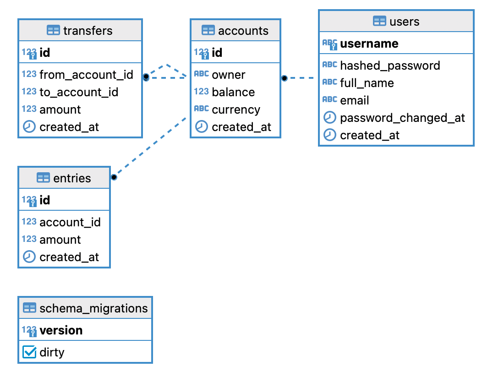

# Simple-Bank App with Golang

## UML-Diagram for Simple-Bank App

## Prerequires

1. go-migration: For do a DB migration -> https://github.com/golang-migrate/migrate

2. sqlc: For generate golang CRUD query code from sql -> https://github.com/kyleconroy/sqlc

## Go Package which using in Project

1. pq: Postgres Driver -> https://github.com/lib/pq
2. testify: For write an unit-test -> https://github.com/stretchr/testify
3. gin: HTTP REST Framework -> https://github.com/gin-gonic/gin
4. viper: ENV Variabels loading tools -> https://github.com/spf13/viper
5. gomock: For mocking DB for unit-test (* Need to export PATH before using: export PATH=$PATH:~/go/bin ) -> https://github.com/golang/mock

As for command usage -> You can see at Makefile